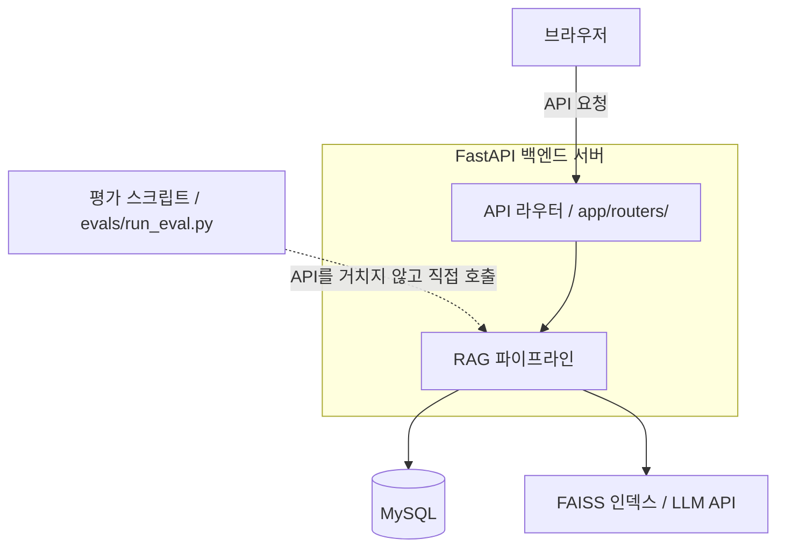
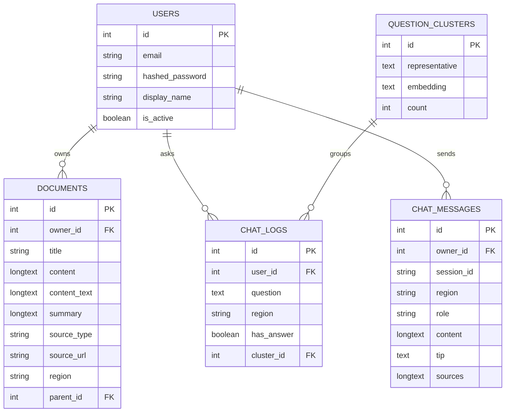
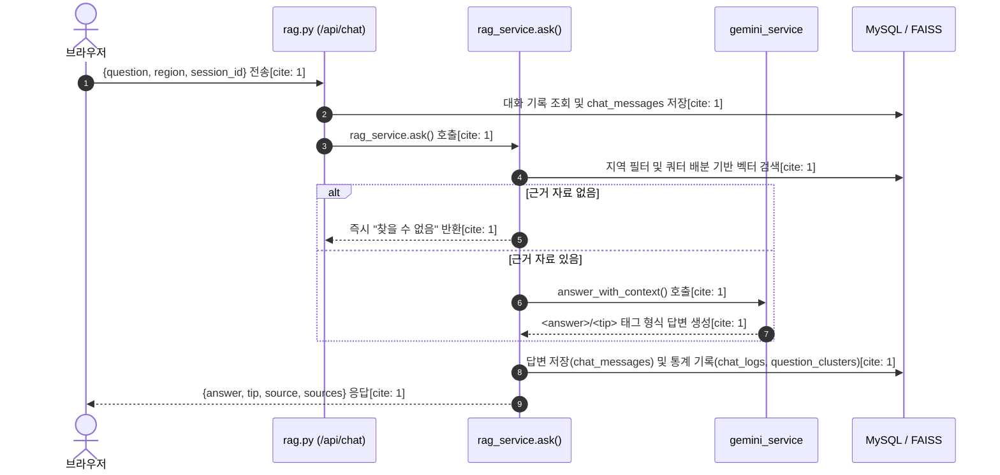
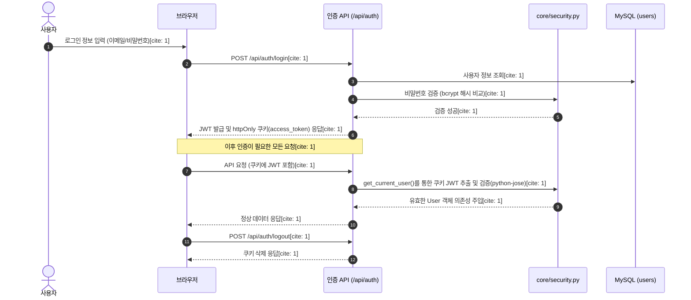

## Ecobot 시스템 아키텍처 및 흐름도 문서

GitHub 최신 상태 기준의 Ecobot 시스템 아키텍처 문서이며, 텍스트로 기술되었던 구조 및 처리 흐름을 시각적인 다이어그램(이미지 형태로 렌더링되는 Mermaid)으로 변환하여 포함하였습니다.

---

## 1. 개요

Ecobot은 지역별(서울·천안·부산 남구·제주·인천 미추홀구 등) 분리배출 가이드와 환경 법령을 근거로 답변하는 RAG 기반 챗봇입니다. FastAPI 백엔드, MySQL, FAISS 벡터 검색, Gemini/OpenAI LLM으로 구성됩니다.

---

## 2. 전체 구조 다이어그램

시스템의 전체적인 구성 요소와 호출 관계를 시각화한 다이어그램입니다.

---

## 3. 계층별 구조

### 3-1. API 라우터 (`app/routers/`)

* **`api.py`**: 인증(`/api/auth/*`, `/api/me`), 문서 CRUD 처리

* **`rag.py`**: 챗봇(`/api/chat`), 대화방 복원(`/api/chat/sessions`), 인덱스 관리, 인기 질문 처리

* **`admin.py`**: 관리자 대시보드 통계·문서 관리·업로드 기능

### 3-2. 서비스 계층 (`app/services/`)

* **`chunk_service.py`**: 문서 청킹 (법령: 조문 단위, 가이드: 품목 단위)

* **`embedding_service.py`**: 텍스트를 벡터로 변환하며 `local`/`gemini`/`openai`/`hash` 백엔드 전환 및 디스크 캐시 지원

* **`vector_store_service.py`**: FAISS 인덱스 생성·저장·검색 및 차원 불일치 검증 수행

* **`gemini_service.py`**: LLM 호출(`LLM_BACKEND`로 Gemini/OpenAI 전환), `<answer>`/`<tip>` 태그 파싱

* **`rag_service.py`**: 지역/공통/법령 자리 배분(`_apply_quota`)을 수행하는 오케스트레이터

* **`auth_service.py`**: 회원가입(`register_user`) 및 로그인 검증(`authenticate_user`) 처리

* **`document_service.py`**: 문서 CRUD 로직, 순환 참조 방지 검증(`check_circular_dependency`) 포함

* **`tools_service.py`**: 파일 텍스트 추출 함수(`extract_text_from_file`) 제공

### 3-3. 평가 (`evals/`)

* **`qa_set.json`**: 정답셋 (질문·모범답안·필수/금지 키워드·지역 구분)

* **`run_eval.py`**: API를 거치지 않고 `rag_service`를 직접 호출하여 답변 품질을 측정하는 평가 스크립트

### 3-4. 데이터 저장

* **MySQL**: `users`, `documents`, `chat_logs`, `chat_messages`, `question_clusters` 테이블 관리

* **FAISS**: `data/indexes/index.faiss` 및 `chunks.json` 활용

* **원문 데이터**: `data/laws/`, `data/guides/` 경로에 법령 및 가이드 원문 적재

---

## 4. 데이터베이스 스키마 (ERD)

---

## 5. 요청 처리 흐름 (`/api/chat`) 다이어그램

브라우저에서 사용자의 질문이 입력되고 응답이 반환되기까지의 처리 과정을 시각화한 순서도입니다.

---

## 6. 인증 및 보안 흐름 다이어그램

JWT와 httpOnly 쿠키를 활용하여 보안을 유지하는 인증 처리 흐름입니다.

