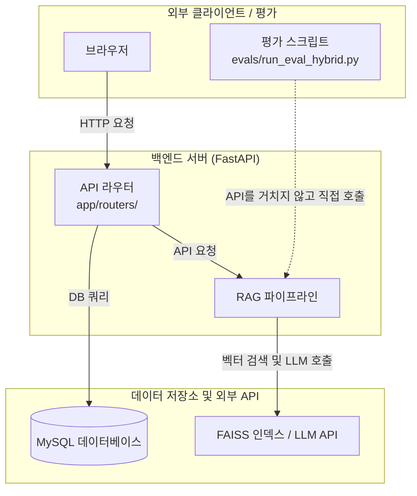
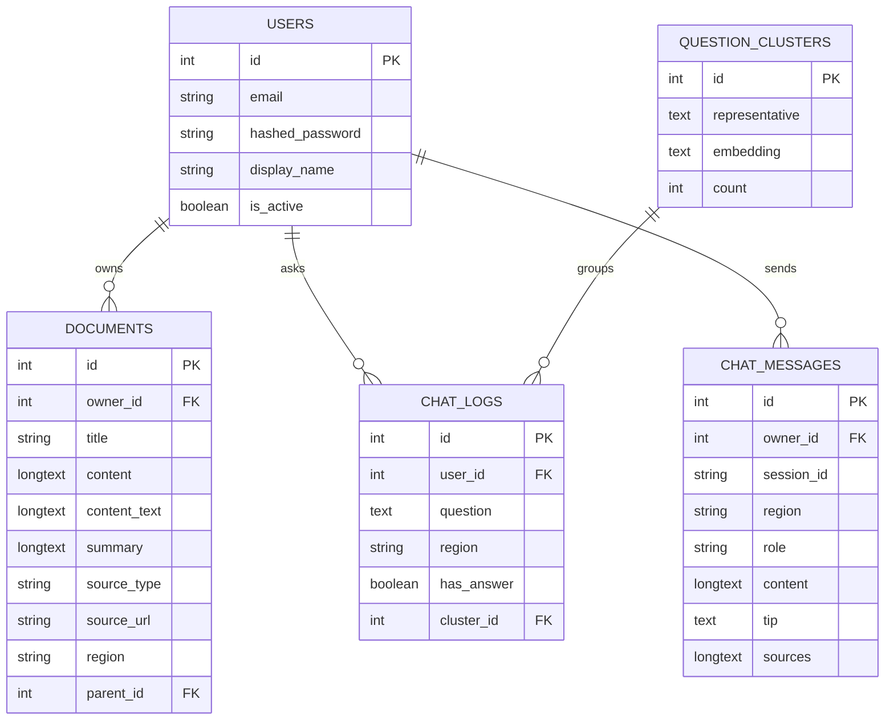
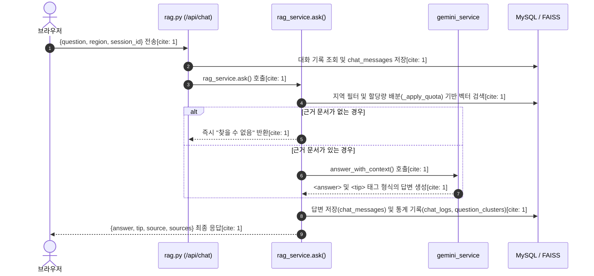
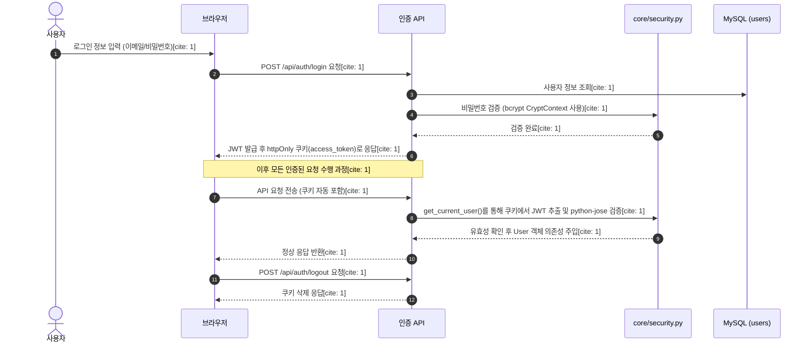

## Ecobot 시스템 아키텍처 및 상세 설명 문서

## 1. 개요

Ecobot은 서울, 천안, 부산 남구, 제주, 인천 미추홀구 등의 지역별 분리배출 가이드와 환경 법령을 근거로 답변을 제공하는 RAG(Retrieval-Augmented Generation) 기반 챗봇 시스템입니다. 본 시스템은 FastAPI 백엔드, MySQL 데이터베이스, FAISS 벡터 검색 엔진, 그리고 Gemini/OpenAI LLM을 조합하여 구축되었습니다.

---

## 2. 전체 구조 및 아키텍처

Ecobot의 전체적인 구조는 브라우저 클라이언트, FastAPI 백엔드 서버(API 라우터 및 RAG 파이프라인), 그리고 MySQL 및 FAISS 벡터 저장소/LLM API 간의 연동으로 구성됩니다. 또한, 평가 스크립트는 API 서버를 거치지 않고 직접 RAG 서비스를 호출하여 성능을 측정합니다.

---

## 3. 계층별 상세 설명

### 3-1. API 라우터 (`app/routers/`)

API 라우터 계층은 클라이언트의 요청을 받아 각 서비스 계층으로 전달하는 진입점 역할을 담당합니다.

* **`api.py`**: 사용자 인증 관련 엔드포인트(`/api/auth/*`, `/api/me`)와 문서 CRUD 기능을 담당합니다.

* **`rag.py`**: 챗봇 대화(`/api/chat`), 대화방 세션 복원(`/api/chat/sessions`), 인덱스 관리, 그리고 인기 질문 조회를 처리합니다.

* **`admin.py`**: 관리자 대시보드용 통계 조회, 문서 관리 및 업로드 기능을 제공합니다.

### 3-2. 서비스 계층 (`app/services/`)

핵심 비즈니스 로직이 구현되어 있는 서비스 계층입니다.

* **`chunk_service.py`**: 문서를 적절한 크기로 청킹합니다 (법령은 조문 단위, 가이드는 품목 단위로 처리).

* **`embedding_service.py`**: 텍스트를 벡터로 변환하며, `local`, `gemini`, `openai`, `hash` 등의 백엔드 전환과 디스크 캐시 기능을 지원합니다.

* **`vector_store_service.py`**: FAISS 벡터 인덱스의 생성, 저장, 검색을 담당하며 차원 불일치 검증을 수행합니다.

* **`gemini_service.py`**: LLM 호출을 처리하며 `LLM_BACKEND` 설정에 따라 Gemini 또는 OpenAI로 동적 전환이 가능합니다. 또한 `<answer>` 및 `<tip>` 태그 파싱을 수행합니다.

* **`rag_service.py`**: RAG 오케스트레이터로, 검색 결과에서 지역, 공통, 법령 데이터의 할당 비율을 배분하는 `_apply_quota` 로직을 수행합니다.

* **`auth_service.py`**: 회원가입(`register_user`) 및 로그인 검증(`authenticate_user`) 로직을 처리하며, 비밀번호 해시 및 JWT 발급은 `core/security.py`에 위임합니다.

* **`document_service.py`**: 문서 CRUD 로직을 담당합니다. 문서의 `content`는 JSON 문자열로 직렬화하여 저장하고 조회 시 역직렬화하며, 트리 구조 조회 시 순환 참조를 방지하기 위한 `check_circular_dependency` 검증을 포함합니다.

* **`tools_service.py`**: 파일에서 텍스트를 추출하는 `extract_text_from_file` 함수 하나로 구성되어 있습니다.

### 3-3. 평가 시스템 (`evals/`)

* **`qa_set.json`**: 질문, 모범답안, 필수/금지 키워드, 그리고 지역 구분이 포함된 정답 세트입니다.

* **`run_eval_hybrid.py`**: FastAPI 서버를 거치지 않고 `rag_service`를 직접 호출하여 LLM+규칙 혼합 방식으로 답변 품질을 측정하는 평가 스크립트입니다.

### 3-4. 데이터 저장소

* **MySQL**: `users`(계정), `documents`(법령·가이드·개인 문서), `chat_logs`(통계 로그), `chat_messages`(대화 원문), `question_clusters`(질문 클러스터링) 테이블을 관리합니다.

* **FAISS**: 벡터 검색을 위해 `data/indexes/index.faiss` 및 `chunks.json`을 사용합니다.

* **원문 데이터**: `data/laws/` 및 `data/guides/` 경로에 법령 및 가이드 원문 파일이 위치합니다.

---

## 4. 데이터베이스 스키마 (ERD)

### 주요 테이블 역할 설명

* **`users`**: 시스템 사용자 계정 정보를 관리합니다.

* **`documents`**: 법령, 가이드, 개인 문서를 저장하며, `parent_id`를 통해 자기 자신을 참조하는 트리 구조(문서 하위 문서)를 지원합니다. `region`이 NULL이거나 `"common"`인 경우 전국 공통으로 처리됩니다.

* **`chat_logs`**: 관리자 대시보드 집계를 위한 챗봇 질문 통계 로그를 `chat_messages`와 별개로 유지합니다.

* **`chat_messages`**: 대화 원문 전체를 보관하며, `session_id`로 대화방을 구분하고 `sources`는 JSON 문자열로 저장합니다.

* **`question_clusters`**: 인기 질문(`/api/popular-questions`) 집계를 위한 질문 임베딩 클러스터링 데이터를 관리합니다.

---

## 5. 요청 처리 흐름 (`/api/chat`)

사용자가 챗봇에 질문을 던지고 답변을 받는 메인 흐름의 상세 단계입니다.

---

## 6. API 명세 요약

Swagger(`/docs`) 실제 화면 기준으로 확인된 주요 엔드포인트 목록입니다.

| 분류 | HTTP Method | Endpoint Path | 설명 |
| --- | --- | --- | --- |
| **인증 (`api.py`)** | POST | /api/auth/register | 회원가입 |
| **인증 (`api.py`)** | POST | /api/auth/login | 로그인 |
| **인증 (`api.py`)** | POST | /api/auth/logout | 로그아웃 |
| **인증 (`api.py`)** | GET | /api/me | 현재 사용자 정보 조회 |
| **문서 (`api.py`)** | POST | /api/documents | 문서 생성 |
| **문서 (`api.py`)** | GET | /api/documents | 문서 목록 조회 |
| **문서 (`api.py`)** | GET | /api/documents/tree | 문서 트리 구조 조회 |
| **문서 (`api.py`)** | GET | /api/documents/{doc_id} | 문서 단건 조회 |
| **문서 (`api.py`)** | PUT | /api/documents/{doc_id} | 문서 수정 |
| **문서 (`api.py`)** | DELETE | /api/documents/{doc_id} | 문서 삭제 |
| **문서 (`api.py`)** | POST | /api/documents/{doc_id}/summary | 문서 요약 |
| **문서 (`api.py`)** | POST | /api/gemini/summarize | 임의 텍스트 요약 |
| **챗봇 / RAG (`rag.py`)** | POST | /api/chat | 챗봇 메인 대화 |
| **챗봇 / RAG (`rag.py`)** | GET | /api/chat/sessions | 대화방 목록 조회 및 복원 |
| **챗봇 / RAG (`rag.py`)** | POST | /api/rag/rebuild | 인덱스 재구축 |
| **챗봇 / RAG (`rag.py`)** | POST | /api/rag/search | 검색 결과만 확인 (디버그) |
| **챗봇 / RAG (`rag.py`)** | GET | /api/rag/status | 인덱스 상태 확인 |
| **챗봇 / RAG (`rag.py`)** | GET | /api/popular-questions | 인기 질문 TOP N 조회 |
| **관리자 (`admin.py`)** | GET | /api/admin/stats | 전체 통계 조회 |
| **관리자 (`admin.py`)** | GET | /api/admin/top-questions | 자주 묻는 질문 조회 |
| **관리자 (`admin.py`)** | GET | /api/admin/region-stats | 지역별 질문 분포 조회 |
| **관리자 (`admin.py`)** | GET | /api/admin/daily-trend | 일별 질문 추이 조회 |
| **관리자 (`admin.py`)** | GET | /api/admin/documents | 인덱싱된 문서 목록 조회 |
| **관리자 (`admin.py`)** | POST | /api/admin/upload | 문서 파일 업로드 및 인덱싱 |
| **기타** | GET | /api/health | 서버 헬스체크 |

---

## 7. 인증 및 보안 흐름

Ecobot은 보안 강화를 위해 세션 대신 JWT와 `httpOnly` 쿠키를 채택하고 있습니다.

### 보안 핵심 포인트

* **비밀번호 보호**: `POST /api/auth/register` 시 비밀번호는 `bcrypt`(`passlib`의 `CryptContext`)를 통해 해시된 형태로 `users` 테이블에 안전하게 저장됩니다.

* **XSS 방지 (`httpOnly` 쿠키)**: 로그인 시 발급되는 JWT는 JavaScript에서 직접 접근할 수 없는 `httpOnly` 쿠키(`access_token`)에 담겨 관리되므로, XSS 취약점을 통한 토큰 탈취 위험을 원천 차단합니다.

* **의존성 주입 기반 검증**: 이후 모든 요청은 `get_current_user()` 함수가 쿠키의 JWT를 `python-jose`로 검증하여 유효한 사용자 객체를 보장합니다.

---

## 8. 외부 LLM 및 임베딩 연동

Ecobot은 다양한 LLM 백엔드와 임베딩 방식을 유연하게 전환할 수 있는 구조를 갖추고 있습니다.

* **지원 LLM 및 임베딩 백엔드**
    * Google Gemini API (`LLM_BACKEND=gemini`, `EMBEDDING_BACKEND=gemini`)
    * OpenAI API (`LLM_BACKEND=openai`, `EMBEDDING_BACKEND=openai`)
    * Local 계산 (`EMBEDDING_BACKEND=local`) — 외부 API 키 없이 `sentence-transformers`(`intfloat/multilingual-e5-small`) 모델을 활용하여 로컬에서 임베딩을 계산합니다.

* **할당량 초과(429) 예외 처리**
    * 외부 LLM 호출 시 할당량 초과(429) 에러가 발생할 경우 이를 감지하는 로직이 내장되어 있습니다.
    * 에러 발생 시 서버가 비정상 종료되지 않고, 사용자에게 `"현재 API 사용량이 초과되었습니다"`라는 안내 문구를 그대로 반환하여 안정성을 유지합니다.

* **디스크 캐시를 통한 비용 절감**
    * 임베딩 API 호출은 디스크 캐시(`data/indexes/embedding_cache.json`)를 경유하도록 설계되어 있습니다.
    * 동일한 텍스트를 재인덱싱할 때 불필요한 API 호출을 방지하여 비용과 할당량을 크게 절감합니다.
