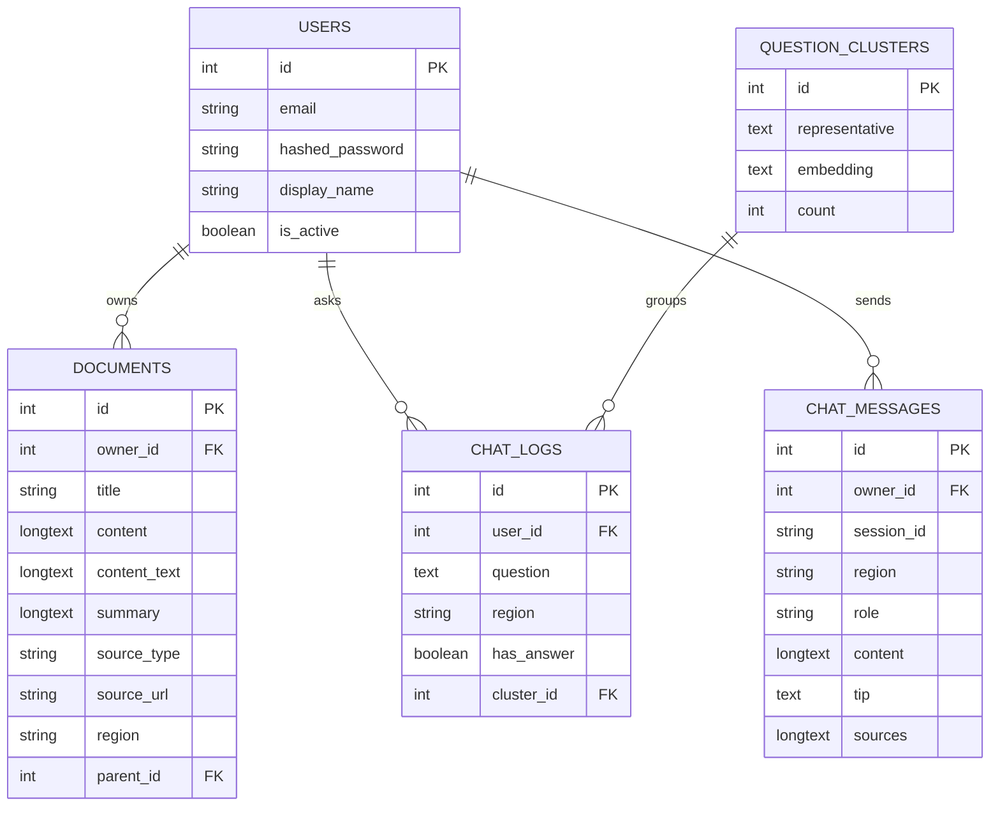

# Ecobot 시스템 아키텍처 문서 (GitHub 최신 상태 기준)

## 1. 개요

Ecobot은 지역별(서울·천안·부산 남구·제주·인천 미추홀구 등) 분리배출 가이드와 환경 법령을 근거로 답변하는 RAG 기반 챗봇이다. FastAPI 백엔드 + MySQL + FAISS 벡터 검색 + Gemini/OpenAI LLM으로 구성된다.

## 2. 전체 구조

```
브라우저                평가 스크립트 (evals/run_eval.py)
   │                          │  (API를 거치지 않고 직접 호출)
   ▼                          │
┌─────────────────────────────┼─────────┐
│         백엔드 서버 (FastAPI) │         │
│                             │         │
│   ┌──────────────┐   ┌──────▼───────┐ │
│   │  API 라우터   │──▶│ RAG 파이프라인 │ │
│   └──────────────┘   └──────────────┘ │
└─────────────────────────────────────────┘
      │                       │
      ▼                       ▼
   MySQL                FAISS 인덱스 / LLM API
```

## 3. 계층별 설명

### 3-1. API 라우터 (`app/routers/`)

| 파일 | 담당 |
|---|---|
| `api.py` | 인증(`/api/auth/*`, `/api/me`), 문서 CRUD |
| `rag.py` | 챗봇(`/api/chat`), 대화방 복원(`/api/chat/sessions`), 인덱스 관리, 인기 질문 |
| `admin.py` | 관리자 대시보드 통계·문서 관리·업로드 |

### 3-2. 서비스 계층 (`app/services/`)

| 파일 | 역할 | 확인 상태 |
|---|---|---|
| `chunk_service.py` | 문서 청킹 (법령: 조문 단위, 가이드: 품목 단위) | 확인함 |
| `embedding_service.py` | 텍스트→벡터. `local`/`gemini`/`openai`/`hash` 백엔드 전환, 디스크 캐시 | 확인함 |
| `vector_store_service.py` | FAISS 인덱스 생성·저장·검색, 차원 불일치 검증 | 확인함 |
| `gemini_service.py` | LLM 호출(`LLM_BACKEND`로 Gemini/OpenAI 전환), `<answer>`/`<tip>` 태그 파싱 | 확인함 |
| `rag_service.py` | 오케스트레이터. 지역/공통/법령 자리 배분(`_apply_quota`) | 확인함 |
| `auth_service.py` | 회원가입(`register_user`)·로그인 검증(`authenticate_user`). 비밀번호 해시·JWT 발급은 `core/security.py`에 위임 | 확인함 |
| `document_service.py` | 문서 CRUD 로직. `content`는 JSON을 문자열로 직렬화해서 저장, 조회 시 역직렬화. 트리 조회 시 순환 참조 방지 검증(`check_circular_dependency`) 포함 | 확인함 |
| `tools_service.py` | 파일에서 텍스트를 추출하는 함수 하나(`extract_text_from_file`)만 있음 — 어디서 쓰이는지는 호출부 확인 필요 | 확인함(단순) |

### 3-3. 평가 (`evals/`)

| 파일 | 역할 |
|---|---|
| `qa_set.json` | 정답셋 (질문·모범답안·필수/금지 키워드·지역 구분) |
| `run_eval.py` | 평가 스크립트. **API를 거치지 않고 `rag_service`를 직접 호출**해서 답변 품질을 측정 |

### 3-4. 데이터 저장

**MySQL**: `users`, `documents`(법령·가이드·개인 문서), `chat_logs`(통계), `chat_messages`(대화 원문), `question_clusters`(질문 클러스터링)

**FAISS**: `data/indexes/index.faiss` + `chunks.json`

**법령·가이드 원문** (`data/laws/`, `data/guides/`): 최근 파일 구성이 다시 바뀌어서, 정확한 최신 목록은 재확인이 필요하다.

## 4. 데이터베이스 스키마 (ERD)



### 테이블별 설명

| 테이블 | 역할 | 비고 |
|---|---|---|
| `users` | 계정 | |
| `documents` | 법령·가이드·개인 문서 | `parent_id`로 자기 자신을 참조하는 트리 구조(문서 하위 문서) 지원. `region`은 NULL 또는 `"common"`이면 전국 공통 |
| `chat_logs` | 챗봇 질문 통계 로그 | 관리자 대시보드 집계용. `chat_messages`와 별개로 유지 |
| `chat_messages` | 대화 원문 전체 | `session_id`로 대화방 구분, `sources`는 JSON 문자열로 저장 |
| `question_clusters` | 질문 임베딩 클러스터링 | 인기 질문(`/api/popular-questions`) 집계용 |

## 5. 요청 처리 흐름 (`/api/chat`)

1. 브라우저가 `{question, region, session_id}`를 `/api/chat`으로 전송
2. `rag.py`가 대화 기록 조회/저장 (`chat_messages`)
3. `rag_service.ask()` → 벡터 검색(`region` 필터 + 자리 배분) → 근거 없으면 즉시 "찾을 수 없음" 반환
4. `gemini_service.answer_with_context()`가 `<answer>`/`<tip>` 태그로 답변 생성
5. 답변 저장(`chat_messages`) + 통계 기록(`chat_logs`, `question_clusters`)
6. `{answer, tip, source, sources}` 응답

## 6. API 명세

Swagger(`/docs`) 실제 화면 기준으로 확인한 전체 엔드포인트다.

### 인증 (`api.py`)

| Method | Path | 설명 |
|---|---|---|
| POST | `/api/auth/register` | 회원가입 |
| POST | `/api/auth/login` | 로그인 |
| POST | `/api/auth/logout` | 로그아웃 |
| GET | `/api/me` | 현재 사용자 정보 |

### 문서 (`api.py`)

| Method | Path | 설명 |
|---|---|---|
| POST | `/api/documents` | 문서 생성 |
| GET | `/api/documents` | 문서 목록 |
| GET | `/api/documents/tree` | 문서 트리 조회 |
| GET | `/api/documents/{doc_id}` | 문서 단건 조회 |
| PUT | `/api/documents/{doc_id}` | 문서 수정 |
| DELETE | `/api/documents/{doc_id}` | 문서 삭제 |
| POST | `/api/documents/{doc_id}/summary` | 문서 요약 |
| POST | `/api/gemini/summarize` | 임의 텍스트 요약 |

### 챗봇/RAG (`rag.py`)

| Method | Path | 설명 |
|---|---|---|
| POST | `/api/chat` | 챗봇 메인 |
| GET | `/api/chat/sessions` | 대화방 목록/복원 |
| POST | `/api/rag/rebuild` | 인덱스 재구축 |
| POST | `/api/rag/search` | 검색 결과만 확인(디버그) |
| GET | `/api/rag/status` | 인덱스 상태 확인 |
| GET | `/api/popular-questions` | 인기 질문 TOP N |

### 관리자 (`admin.py`)

| Method | Path | 설명 |
|---|---|---|
| GET | `/api/admin/stats` | 전체 통계 |
| GET | `/api/admin/top-questions` | 자주 묻는 질문 |
| GET | `/api/admin/region-stats` | 지역별 질문 분포 |
| GET | `/api/admin/daily-trend` | 일별 질문 추이 |
| GET | `/api/admin/documents` | 인덱싱된 문서 목록 |
| POST | `/api/admin/upload` | 문서 파일 업로드·인덱싱 |

### 기타

| Method | Path | 설명 |
|---|---|---|
| GET | `/api/health` | 헬스체크 |

### 주요 스키마 (Pydantic)

`AuthUser`, `UserCreate`/`UserResponse`, `LoginRequest` — 인증
`DocumentCreate`/`DocumentDetail`/`DocumentUpdate`/`DocumentSummary` — 문서
`ChatRequest`/`ChatResponse`/`ChatSource`/`ChatHistoryItem`/`ChatSessionGroup` — 챗봇
`GeminiRequest`/`SummaryResponse`, `RagSearchRequest` — 요약·검색
`HTTPValidationError`/`ValidationError` — 공통 에러 응답

## 7. 인증/보안 흐름

1. `POST /api/auth/register` — 비밀번호를 `bcrypt`(passlib `CryptContext`)로 해시해서 `users` 테이블에 저장
2. `POST /api/auth/login` — 이메일/비밀번호 검증 후 JWT 발급, **httpOnly 쿠키**(`access_token`)에 담아 응답
3. 이후 모든 요청 — `get_current_user()`가 쿠키에서 JWT를 읽어 검증(`python-jose`), 유효하면 `User` 객체를 의존성으로 주입
4. `POST /api/auth/logout` — 쿠키 삭제

```
로그인 요청 → 비밀번호 검증(bcrypt) → JWT 생성 → httpOnly 쿠키로 응답
                                                      │
매 요청 ← get_current_user() ← 쿠키에서 JWT 추출·검증 ←──┘
```

httpOnly 쿠키를 쓰는 이유는 JS에서 토큰에 직접 접근 못 하게 해서 XSS로 토큰이 탈취되는 걸 막기 위함이다.

## 8. 외부 연동

| 연동 대상 | 용도 | 전환 방식 |
|---|---|---|
| Google Gemini API | 답변 생성 + 임베딩 | `LLM_BACKEND=gemini` / `EMBEDDING_BACKEND=gemini` |
| OpenAI API | 답변 생성 + 임베딩 | `LLM_BACKEND=openai` / `EMBEDDING_BACKEND=openai` |

- 두 LLM 다 **할당량 초과(429) 감지 로직**이 있어서, 초과 시 `"현재 API 사용량이 초과되었습니다"`라는 안내 문구를 사용자에게 그대로 보여줌 (서버가 죽지 않음)
- 임베딩 API 호출은 **디스크 캐시**(`data/indexes/embedding_cache.json`)를 거쳐서, 같은 텍스트를 재인덱싱할 때 API를 다시 안 부름 — 비용·할당량 절감 목적
- `EMBEDDING_BACKEND=local`이면 외부 API 없이 `sentence-transformers`(`intfloat/multilingual-e5-small`)로 로컬 계산 (키 불필요)
